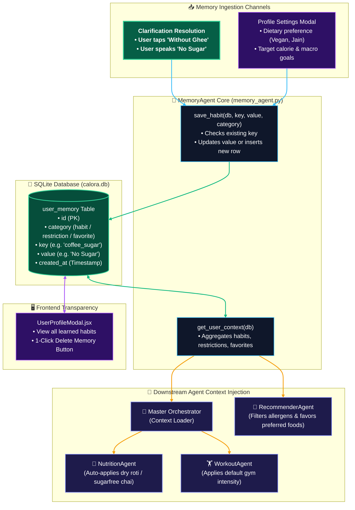

# 🧠 MemoryAgent — Architectural Specification & Technical Guide

`backend/app/agents/memory_agent.py`

---

## 📌 Executive Summary

The **`MemoryAgent`** is Calora AI's persistent context and lifelong learning engine. It manages personalized user preferences, learned culinary habits, dietary restrictions, and workout defaults, eliminating repetitive clarification questions and powering hyper-personalized recommendations.

It features:
1. **Categorized Memory Architecture**: Segregates context into 3 distinct operational buckets: `habits` (e.g., *"roti without ghee"*), `restrictions` (e.g., *"lactose intolerant"*), and `favorites` (e.g., *"paneer bhurji"*).
2. **Upsert Habit Persistence**: Seamlessly updates existing habit keys or inserts new memories into SQLite (`user_memory` table) with zero duplication.
3. **Omnipresent Agent Injection**: Feeds structured habit context to `MasterOrchestratorAgent`, `NutritionAgent`, `WorkoutAgent`, and `RecommenderAgent` on every turn.
4. **User Control & Transparency**: Connects directly to `GET /api/profile/memories` and `DELETE /api/profile/memories/{id}`, enabling users to inspect and delete learned memories at any time via the UI.

---

## 🏛️ Internal Architecture & Memory Lifecycle Diagram



---

## 🔍 Exhaustive Feature Breakdown

### 1. Structured Tri-Category Context Engine

`MemoryAgent.get_user_context()` aggregates memories into three operational domains:

```python
{
    "habits": [
        "coffee_sugar: No Sugar (Black)",
        "roti_ghee: Dry (No Ghee)",
        "tea_milk: Skimmed Milk"
    ],
    "restrictions": [
        "diet: Lactose Intolerant",
        "allergy: Peanuts"
    ],
    "favorites": [
        "breakfast: Oats with Chia Seeds",
        "dinner: Soya Chunks Bhurji"
    ]
}
```

---

### 2. Idempotent Upsert Habit Engine

The `save_habit()` method prevents memory bloat by updating existing keys rather than creating redundant rows:

```python
def save_habit(self, db: Session, key: str, value: str, category: str = "habit"):
    existing = db.query(UserMemory).filter(UserMemory.key == key).first()
    if existing:
        existing.value = value  # In-place update
    else:
        new_mem = UserMemory(category=category, key=key, value=value)
        db.add(new_mem)
    db.commit()
```

* If a user previously logged *"1 tsp sugar in tea"* and later clicks *"No Sugar"*, `save_habit` smoothly overwrites the record without creating duplicate entries.

---

### 3. Impact on Downstream Agents

| Consuming Agent | How `user_memory` is Utilized |
| :--- | :--- |
| **`NutritionAgent`** | Automatically factors in dry rotis ($85\text{ kcal}$), sugarfree coffee ($5\text{ kcal}$), or specific cooking oils without triggering redundant clarification banners. |
| **`WorkoutAgent`** | Defaults to the user's preferred exercise duration or standard intensity (e.g. 45 min strength session) if unspecified. |
| **`RecommenderAgent`** | Strictly excludes restricted foods (e.g. gluten, lactose) and synthesizes recipes featuring user favorite proteins (e.g. tofu, eggs, paneer). |
| **`MasterOrchestrator`** | Pre-populates the prompt context envelope before dispatching to sub-agents. |

---

### 4. Complete User Privacy & Manual Memory Control

Unlike opaque AI memory systems, Calora AI gives users **100% control over their stored memory**:
* **Inspection**: Open the Profile modal in the dashboard to review all active memory cards.
* **Granular Deletion**: Users can click the trash icon next to any learned habit (e.g., delete `coffee_sugar`) via `DELETE /api/profile/memories/{id}`, instantly resetting that specific preference.

---

## 🧪 Sample Ingestion Benchmarks

| Trigger Event | Key Stored | Value Stored | Category | Downstream Effect |
| :--- | :--- | :--- | :---: | :--- |
| User answers *"No Sugar"* on Coffee | `coffee_type` | `Black (No Milk, No Sugar)` | `habit` | Future coffee logs default to $5\text{ kcal}$ |
| User answers *"Without Ghee"* on Roti | `roti_ghee` | `Dry (No Ghee)` | `habit` | Future rotis default to $85\text{ kcal}$ ($0\text{g}$ added fat) |
| User sets *"Vegetarian"* in Profile | `dietary_pref` | `Vegetarian` | `restriction` | Recommender suppresses non-veg recipes |
| User logs *"50 min gym session"* | `gym_duration` | `50 Minutes` | `habit` | Workout agent assumes 50 min baseline |
