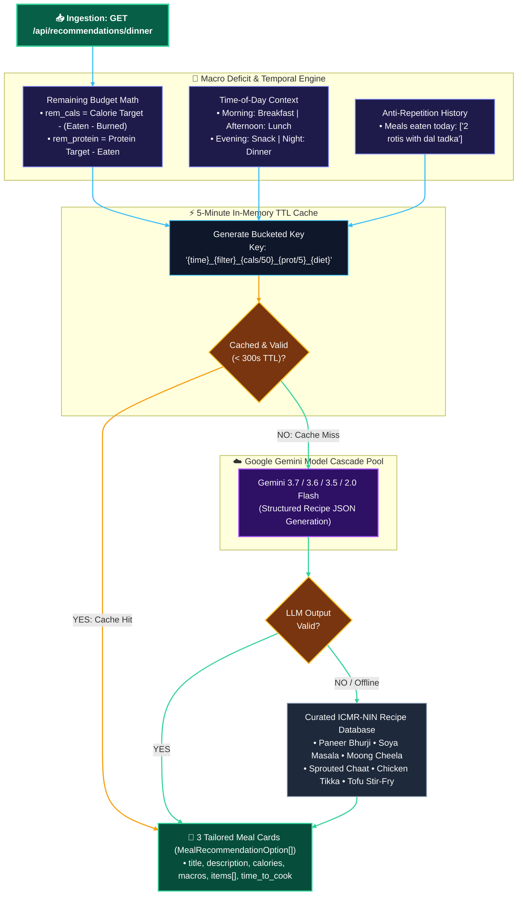

# 🎯 RecommenderAgent — Architectural Specification & Technical Guide

`backend/app/agents/recommender_agent.py`

---

## 📌 Executive Summary

The **`RecommenderAgent`** is Calora AI's proactive nutrition optimizer and meal planner. It calculates remaining daily calorie and macronutrient targets ($\Delta\text{Calories}, \Delta\text{Protein}, \Delta\text{Carbs}, \Delta\text{Fat}$) and synthesizes **3 distinct, chef-grade recipe options** fitted to the exact mathematical deficit.

It features:
1. **Dynamic Macro Deficit Solver**: Synthesizes recipes that fit remaining calories and protein targets within a $\pm 10\%$ tolerance.
2. **Anti-Repetition Engine**: Cross-checks `meals_eaten_today` to guarantee diversity (e.g., if you had dal for lunch, it avoids suggesting dal for dinner).
3. **Time-of-Day Context Engine**: Automatically shifts recommendations across `breakfast`, `lunch`, `evening snack`, and `dinner` based on current clock time.
4. **5-Minute In-Memory TTL Cache**: Bucketed macro cache that saves $>80\%$ of Gemini API calls on page reloads.
5. **Interactive Dietary & Speed Filters**: Supports 1-tap filters like `High Protein`, `Quick (<15m)`, `Low Carb`, and custom ingredient searches.
6. **Curated Offline Chef Database**: Hardcoded ICMR-NIN macro-balanced recipes (Paneer Bhurji, Soya Masala, Moong Cheela, Tofu Stir-Fry, Chicken Tikka) for 100% offline uptime.

---

## 🏛️ Internal Architecture & Recommendation Pipeline Diagram



---

## 🔍 Exhaustive Feature Breakdown

### 1. Dynamic Net Macro Deficit Calculation

The recommendation engine dynamically computes remaining allowances by factoring in today's **burned workout calories**:

$$\text{Remaining Calories} = \max\Big(150.0, \text{Target}_{\text{cals}} - \max\big(0.0, \text{Eaten}_{\text{cals}} - \text{Burned}_{\text{cals}}\big)\Big)$$

$$\text{Remaining Protein} = \max\Big(10.0, \text{Target}_{\text{protein}} - \text{Eaten}_{\text{protein}}\Big)$$

* Exercising awards energy budget back to the user, allowing the AI to recommend hearty, replenishing post-workout dinners without artificially starving their evening allowance.

---

### 2. The 5-Minute Bucketed In-Memory TTL Cache

To eliminate redundant Gemini API requests when users switch tabs or tweak minor settings:

```python
cache_bucket_cals = round(remaining_calories / 50)
cache_bucket_prot = round(remaining_protein / 5)
cache_key = f"{time_context}_{active_filter}_{cache_bucket_cals}_{cache_bucket_prot}_{dietary_preference}"
```

* Quantizing calories to $50\text{ kcal}$ buckets and protein to $5\text{g}$ buckets achieves **instant $(<1\text{ms})$ responses** while preserving high mathematical accuracy.
* Entries expire automatically after **$300\text{ seconds}$** ($5\text{ minutes}$).

---

### 3. Anti-Repetition Freshness Guard

Users dislike eating the same meal repeatedly. The agent inspects `meals_eaten_today`:
* If you logged `"Dal Tadka and Rice"` for lunch:
  * Gemini receives the prompt: *"Meals already eaten today: Dal Tadka and Rice. Ensure recommendations offer fresh culinary variety and do NOT duplicate these exact dishes."*
  * The agent prioritizes complementary proteins (e.g., Paneer Bhurji, Soya Sabzi, Tofu Stir-Fry, Boiled Eggs).

---

### 4. Time-of-Day Context Intelligence

Recommendations dynamically adapt to the user's local clock:

| Time Range | Operational Context | Culinary Focus & Digestibility |
| :--- | :---: | :--- |
| **05:00 AM – 11:00 AM** | `breakfast` | High-protein morning energy, oats, eggs, sprouted lentils, besan cheela. |
| **11:00 AM – 04:00 PM** | `lunch` | Complex carbs, phulkas, dal, paneer curries, steamed rice, salads. |
| **04:00 PM – 07:00 PM** | `evening snack` | Light protein chaats, roasted makhanas, boiled eggs, protein shakes. |
| **07:00 PM – 04:59 AM** | `dinner` | Easily digestible, low glycemic index, lean proteins, light sabzis, soup. |

---

### 5. Interactive UI Filters

Users can click interactive chips on the frontend to steer AI generation:
* ⚡ **Quick (<15 Mins)**: Prioritizes minimal prep time (e.g. Scrambled Paneer, Moong Chaat).
* 🥩 **High Protein**: Maximizes protein density per calorie.
* 🥗 **Low Carb / Keto**: Emphasizes leafy greens, healthy fats, and pure proteins.
* 🌿 **Dietary**: Vegetarian, Eggetarian, Vegan, Non-Vegetarian, Jain.

---

## 🧪 Curated Baseline Recommendations Database

| Recipe Title | Cooking Time | Calories | Protein | Carbs | Fat | Dietary Type |
| :--- | :---: | :---: | :---: | :---: | :---: | :---: |
| **Paneer Bhurji & Multigrain Phulkas** | `15 mins` | **$420\text{ kcal}$** | $24.0\text{g}$ | $38.0\text{g}$ | $18.0\text{g}$ | `Vegetarian` |
| **Soya Chunks Masala & Jeera Rice** | `20 mins` | **$410\text{ kcal}$** | $28.0\text{g}$ | $48.0\text{g}$ | $8.0\text{g}$ | `Vegan` |
| **Sprouted Moong Chaat & Boiled Eggs** | `5 mins` | **$310\text{ kcal}$** | $22.0\text{g}$ | $28.0\text{g}$ | $11.0\text{g}$ | `Eggetarian` |
| **Grilled Chicken Tikka & Mint Chutney** | `20 mins` | **$380\text{ kcal}$** | $36.0\text{g}$ | $8.0\text{g}$ | $12.0\text{g}$ | `Non-Vegetarian` |
| **Moong Dal Cheela with Mint Curd** | `15 mins` | **$350\text{ kcal}$** | $20.0\text{g}$ | $32.0\text{g}$ | $14.0\text{g}$ | `Vegetarian` |
| **Tofu & Broccoli Sesame Stir-Fry** | `12 mins` | **$320\text{ kcal}$** | $21.0\text{g}$ | $18.0\text{g}$ | $14.0\text{g}$ | `Vegan` |
