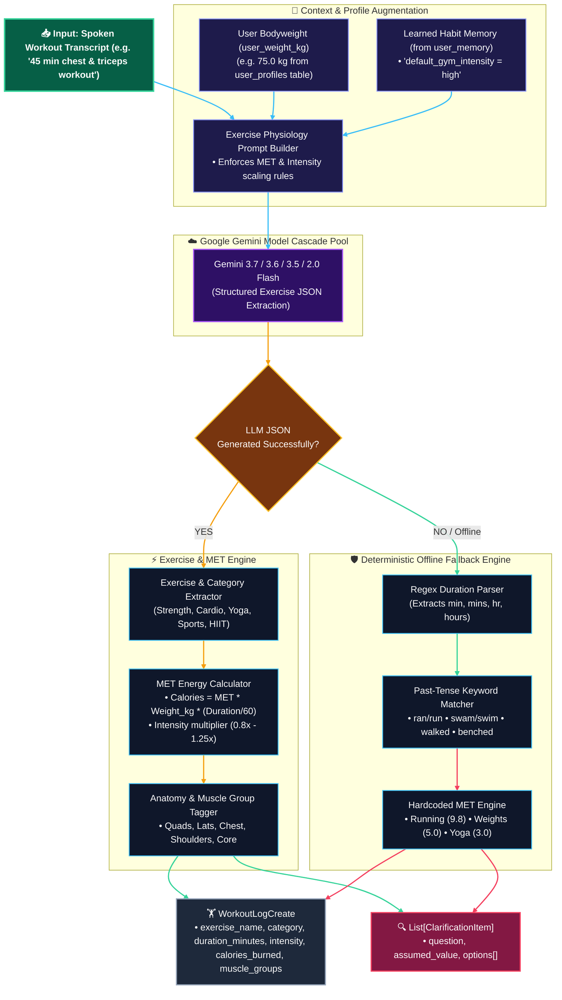

# 🏋️ WorkoutAgent — Architectural Specification & Technical Guide

`backend/app/agents/workout_agent.py`

---

## 📌 Executive Summary

The **`WorkoutAgent`** is Calora AI's exercise physiology intelligence engine. It parses natural voice transcripts or typed workout logs (cardio, strength, yoga, sports, calisthenics) and computes accurate metabolic energy expenditure.

It features:
1. **MET-Based Energy Expenditure Math**: Grounded in the **Compendium of Physical Activities** standard MET (Metabolic Equivalent of Task) values.
2. **User Weight & Intensity Personalization**: Dynamically factors in `user_weight_kg` from `UserProfile` and intensity scaling ($0.8\times$ to $1.25\times$).
3. **Muscle Group & Anatomy Mapping**: Automatically tags primary working muscle groups (e.g. `Chest, Shoulders, Triceps`, `Quadriceps, Glutes, Hamstrings`).
4. **Colloquial Past-Tense Grammar Engine**: Seamlessly interprets natural voice transcripts (*"Ran 5k"*, *"Swam 30 mins"*, *"Walked 8000 steps"*).
5. **Inline Ambiguity Detection**: Detects omitted durations or intensities ($>15\%$ variance) and emits 1-tap clarification pills.
6. **Deterministic Offline Fallback**: Guarantees zero downtime via hardcoded regex duration extractors and MET formulas when cloud LLMs are unreachable.

---

## 🏛️ Internal Architecture & Data Flow Diagram

---

## 🔍 Exhaustive Feature Breakdown

### 1. Metabolic Equivalent of Task (MET) Formula

Calora AI calculates physiological energy expenditure using the **Standardized MET Equation**:

$$\text{Calories Burned (kcal)} = \text{MET}_{\text{effective}} \times \text{Weight}_{\text{kg}} \times \left(\frac{\text{Duration}_{\text{minutes}}}{60}\right)$$

Where:
$$\text{MET}_{\text{effective}} = \text{Base MET} \times \text{Intensity Multiplier}$$

* **High Intensity / HIIT / Heavy Lifts**: $1.25\times$
* **Moderate Intensity (Default)**: $1.00\times$
* **Low / Recovery Intensity**: $0.80\times$

---

### 2. Standard MET Reference Table

| Exercise Activity | Base MET | Category | 70kg User (30 Min Burn) | 80kg User (30 Min Burn) |
| :--- | :---: | :---: | :---: | :---: |
| **Outdoor Running (6 mph / 10 km/h)** | **`9.8`** | `cardio` | **$343.0\text{ kcal}$** | **$392.0\text{ kcal}$** |
| **HIIT / High-Intensity Interval Circuit** | **`8.5`** | `hiit` | **$297.5\text{ kcal}$** | **$340.0\text{ kcal}$** |
| **Swimming (Freestyle / Laps)** | **`8.0`** | `cardio` | **$280.0\text{ kcal}$** | **$320.0\text{ kcal}$** |
| **Outdoor Cycling / Spin Bike** | **`7.5`** | `cardio` | **$262.5\text{ kcal}$** | **$300.0\text{ kcal}$** |
| **Jogging (5 mph / 8 km/h)** | **`7.0`** | `cardio` | **$245.0\text{ kcal}$** | **$280.0\text{ kcal}$** |
| **Strength / Weightlifting (Heavy)** | **`5.5`** | `strength` | **$192.5\text{ kcal}$** | **$220.0\text{ kcal}$** |
| **Badminton / Racquet Sports** | **`5.5`** | `sports` | **$192.5\text{ kcal}$** | **$220.0\text{ kcal}$** |
| **General Resistance Training** | **`5.0`** | `strength` | **$175.0\text{ kcal}$** | **$200.0\text{ kcal}$** |
| **Cricket (Batting / Fielding / Bowling)** | **`4.8`** | `sports` | **$168.0\text{ kcal}$** | **$192.0\text{ kcal}$** |
| **Brisk Walking (3.5 mph / 5.6 km/h)** | **`3.8`** | `cardio` | **$133.0\text{ kcal}$** | **$152.0\text{ kcal}$** |
| **Vinyasa Yoga / Pilates / Mobility** | **`3.0`** | `yoga` | **$105.0\text{ kcal}$** | **$120.0\text{ kcal}$** |

---

### 3. Anatomical Muscle Group Tagging

The agent maps exercise names into specific anatomical target areas:
* **`Chest & Triceps`**: Chest, Anterior Deltoids, Triceps
* **`Back & Biceps`**: Latissimus Dorsi, Rhomboids, Biceps, Forearms
* **`Leg Day / Squats`**: Quadriceps, Glutes, Hamstrings, Calves
* **`Running / Cycling`**: Quadriceps, Hamstrings, Cardiovascular System
* **`Yoga / Pilates`**: Core, Spinal Stabilizers, Full Body Mobility
* **`Swimming`**: Lats, Shoulders, Core, Cardiovascular System

---

### 4. Inline Ambiguity Detection (>15% Delta Rules)

If key exercise parameters are omitted from voice input, the agent triggers **Pre-Log Protection**:
* **Missing Duration**: *"I went for a run"* $\rightarrow$ Asks: *"How long did you run for?"* (`[15 Mins]`, `[30 Mins (Default)]`, `[45 Mins]`, `[60 Mins]`).
* **Missing Intensity**: *"45 min gym workout"* $\rightarrow$ Asks: *"What was your workout intensity?"* (`[Moderate (Default)]`, `[Heavy / To Failure]`, `[Light]`).
* **Bodyweight vs Weighted**: *"Did 50 pullups"* $\rightarrow$ Asks: *"Were they standard bodyweight or weighted pullups?"*

---

### 5. Deterministic Offline Fallback Engine

If the cloud LLM is unreachable, `WorkoutAgent` executes local parsing:
1. **Regex Duration Matching**: Evaluates `(\d+)\s*(?:min|mins|minute|minutes|hr|hrs|hour|hours)`.
2. **Past-Tense Verb Matching**: Recognizes `ran`, `jogged`, `walked`, `swam`, `cycled`, `benched`.
3. **Applies Local MET Math**: Computes exact calories based on user weight.

---

## 🧪 Sample Ingestion Benchmarks

| Voice Input Transcript | User Weight | Extracted Details | Burned Calories | Clarification Triggered |
| :--- | :---: | :--- | :---: | :---: |
| `"45 min chest and triceps workout"` | $75\text{ kg}$ | • 45 min Strength • Moderate Intensity • Chest, Shoulders, Triceps | **$281.3\text{ kcal}$** | None |
| `"Went for a morning run"` | $70\text{ kg}$ | • Outdoor Running • Assumed 30 min (Default) | **$343.0\text{ kcal}$** | `workout_duration` (15/30/45/60 min) |
| `"Cycled 15 km in 40 mins"` | $80\text{ kg}$ | • 40 min Cycling • Moderate-High Intensity | **$400.0\text{ kcal}$** | None |
| `"60 min intense Vinyasa yoga session"` | $65\text{ kg}$ | • 60 min Yoga • High Intensity ($1.25\times$) | **$243.8\text{ kcal}$** | None |
